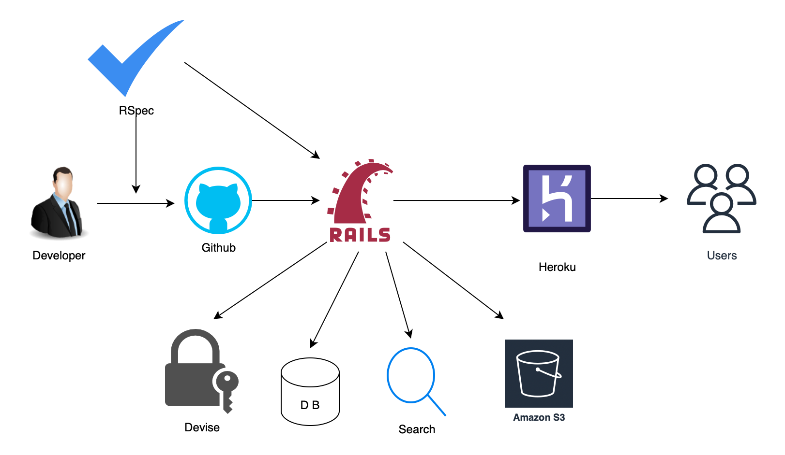
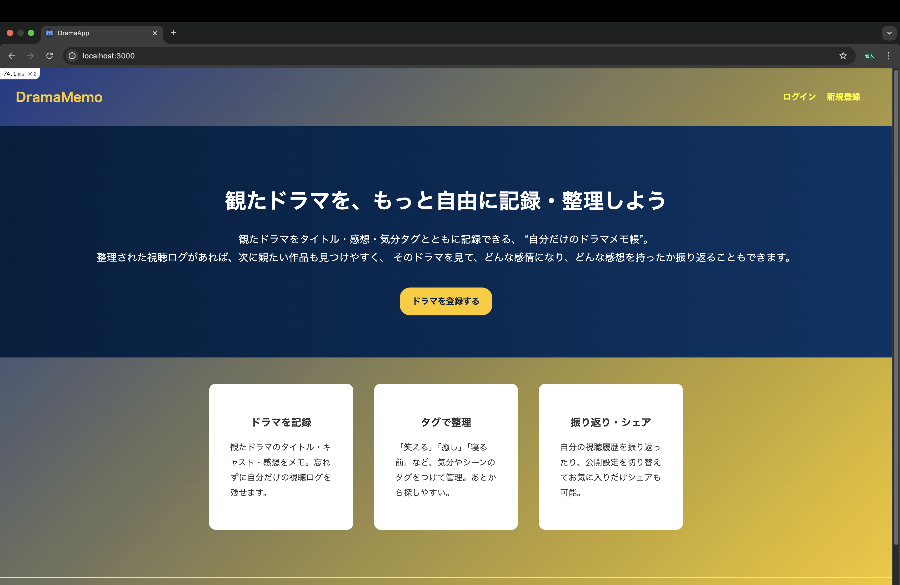
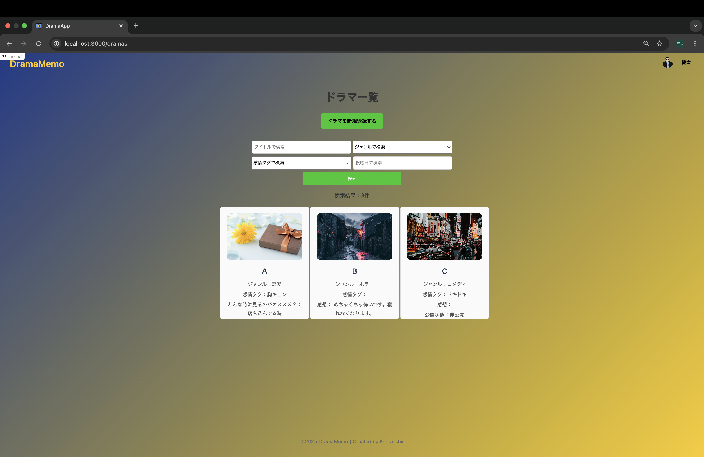
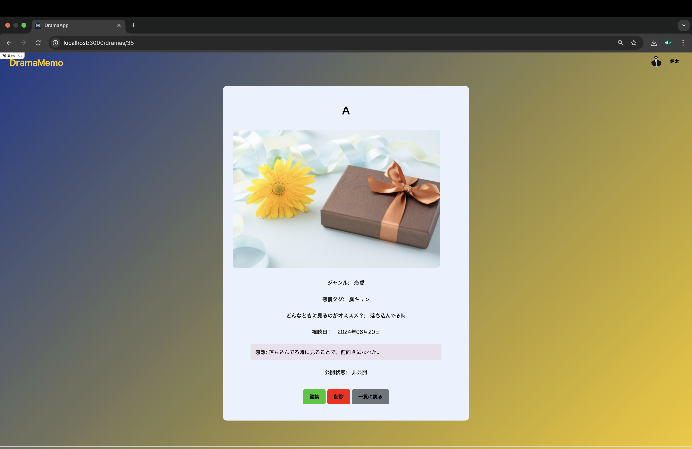
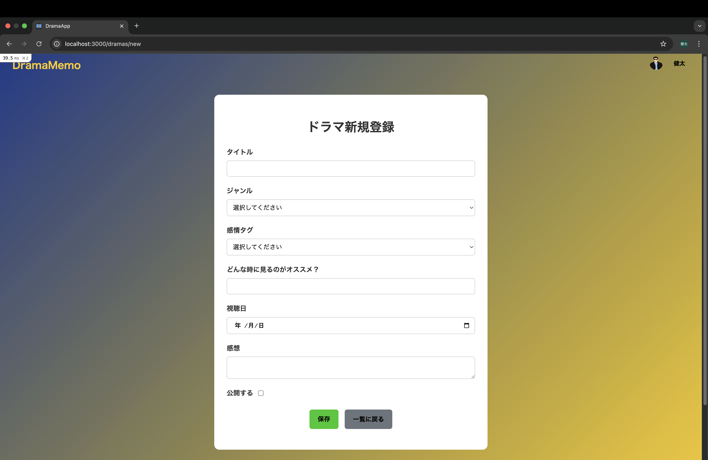
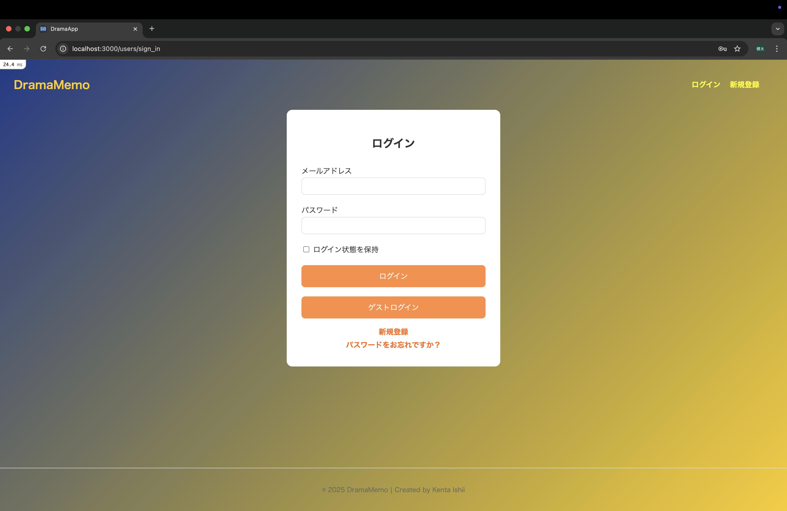
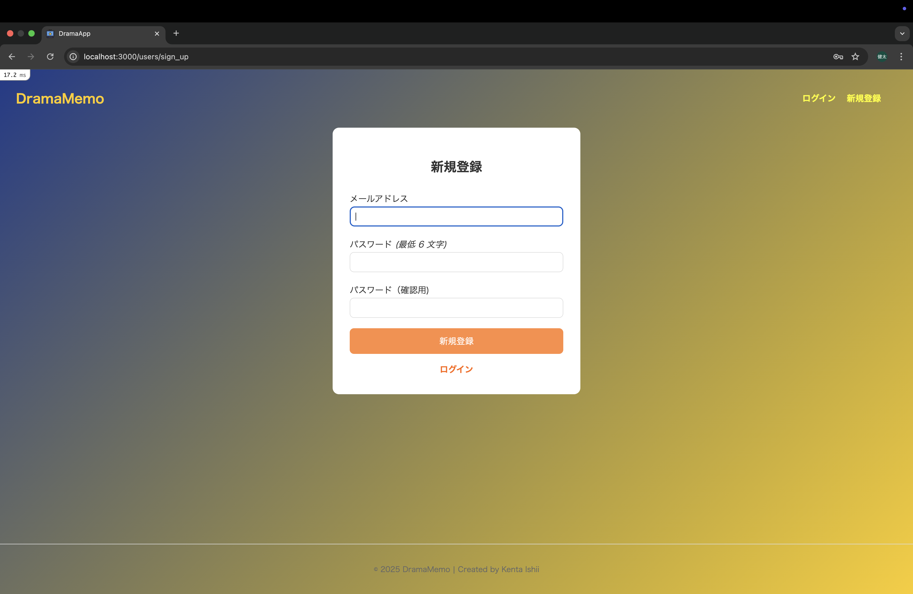

# ドラマメモ

観たドラマを記録・整理できる、視聴ログアプリです。
気分タグを使って、「どんな気分でどんなドラマを観たか」を振り返ることができます。
プライベートなメモアプリとして使いつつ、必要に応じて公開・シェアも可能です。

# アプリURL(Heroku)
https://drama-app-82b1924a525a.herokuapp.com

# アプリ概要

ドラマのタイトル、ジャンル、感情タグ、感想を記録
登録したドラマを検索・絞り込み
公開・非公開の切り替えでプライベートとシェアを両立

# 開発背景

ドラマ鑑賞が好きで、数多くのドラマを観てきましたが、「以前にどんなドラマを観たか思い出せない」、「次何観ようか迷い探すのに時間がかかる」ということが多々ありました。

そこで、自分の視聴履歴をジャンル、感情タグ、感想で整理できるアプリを作ることにしました。

ジャンルや感情タグを登録しておくことで、自分がどんなドラマを好み、それらを観てどんな感情になったのか可視化できます。
これにより、自己分析できるので、次に観たいドラマを選ぶ時間を短縮し、その日の気分にぴったりのドラマをスムーズに見つけられるようになります。

# 使用技術

## システム構成図

フロントエンド　　HTML / CSS / JavaScript
バックエンド　　Ruby ~> 3.3.3 / Rails ~> 6.1
データベース　　SQLite3(開発) / Postgre(本番)
認証　　Devise
デプロイ　　Heroku
テスト　　RSpec / Capybara

# 画面イメージ

## トップページ

## ドラマ一覧・検索画面

## ドラマ詳細画面

## ドラマ登録画面

## ログイン（ゲストログイン）

## 新規登録

# 機能一覧

ユーザー登録　　ログイン / ログアウト（Devise使用）
プロフィール編集
ドラマ登録　　(タイトル、ジャンル、感情タグ、感想)
一覧 / 詳細 / 編集 / 削除 (CRUD)
タグ・ジャンル・キーワード検索
公開 / 非公開の切り替え
RSpec / Capybaraによるテスト整備

# ER図
　 users
id
name
email
introduction
encrypted_password
avatar

　　⬇︎ has_many

   Drama
id
user_id
title
genre
mood
watched_on
impression
is_public

# 今後の課題・改善
- ドラマの並び替え機能の追加
- 公開ドラマを他のユーザーが閲覧できる機能追加
- 視聴傾向を可視化できるようにグラフ化
- 視聴履歴や感情タグをもとにした、AIによるおすすめドラマ提案機能の追加
